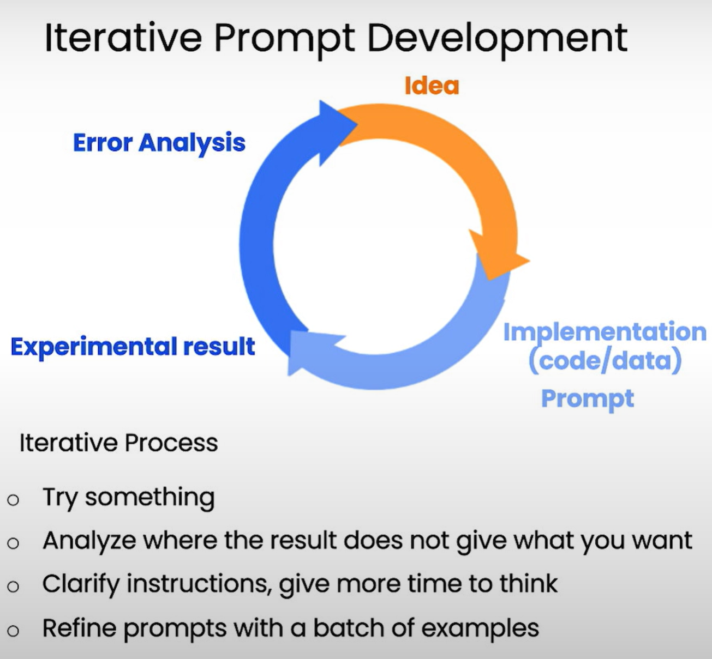

Prompt 是用于同 LLM 大语言模型进行沟通的语言，通过它才能让 LLM 知道应该去做什么以及怎么去做。

<!--more-->

## LLM 能做些什么

CONS：

- Hallucinations
- Size Limitation

## Prompt

Prompting Principles:

- Write clear and specific instructions
  - Use delimiters ```, `"""`, `< >`, `<tag></tag>`, `:`
  - Ask for a structured output, such like JSON, HTML
  - Ask the model to check whether conditions are satisfied
  - "Few-shot" prompting
- Give the model time to “think”
  - Specify the steps required to complete a task
  - Instruct the model to work out its own solution before rushing to a conclusion



## Conversation

use prompt to interact with LLM for **many iteratons** to get final answer for specific task.

many iteratons could help us to break down task into steps, and achieve task step by step.

make sure the context should always related to task, or the answer will not be accurate.

fundamental statements:

- describe of task
- rules, what can do and what cannot do

## Patterns

### (!) Persona Pattern

指出 AI 的角色，然后去执行特定的任务。
这样可以让模型基于角色的专业领域来回答问题，使答案更加准确。

核心 Prompt:

- Act as Persona X
- Perform task Y

### (!) Give more/new information

mostly LLM is trained by data which are not up-to-date,
so given information related to task could help LLM study and then to deal with task.

#### Few-shot

Give some examples for LLM, it could follow the pattern to deal with task.
the examples should be:

- clear
- enough detail
- (optional) intermediate steps

#### Cognitive Verifier Pattern

It used to **generated some questions** for target to collect more infomation,
then use it to generate accurate final answer.

fundamental contextual statements:

- When you are asked a question, follow these rules
- Generate **a number of additional questions** that would help more accurately answer the question
- Combine the answers to the individual questions to produce the final answer to the overall question

#### Flipped Interaction Pattern

It used for AI to ask additional questions related to task step by step to collect more info,
then combine answers to generate final answer.

fundamental contextual statements:

- I would like you to ask me questions to achieve X
- You should **ask questions step by step** until condition Y is met or to achieve this goal (alternatively, forever)
- (Optional) ask me the questions one at a time, two at a time, ask me the first question, etc.

### Step by Step

#### Chain of Thought Prompting

LLM use **reasoning** to break task into steps, it could help LLM generate correct answer.

#### Meta Language Creation Pattern

It used to declare a rule with **short command**,
mostly also needs some few-shot rule examples in context.

fundamental contextual statements:

- When I say X, I mean Y (or would like you to do Y)

### (!) Template Pattern

It always used to define the output format of final answer.

fundamental contextual statements:

- I am going to provide a template for your output
- `<PLACEHOLDER>` is my placeholder for content
- Try to fit the output into one or more of the placeholders that I list
- Please preserve the formatting and overall template that I provide
- This is the template: PATTERN with PLACEHOLDERS

### Audience Persona Pattern

It's used to limit the target background, declare who is the target.

fundamental contextual statements:

- Explain X to me.
- Assume that I am Persona Y.

### Refinement Patterns

These patterns help us refine and find out **available solutions** with full steps.

#### Question Refinement Pattern

It used to refine user input in a more professional way based on context.

fundamental contextual statements:

- whenever I ask a question, suggest a better version of the question to use instead
- (Optional) Prompt me if I would like to use the better version instead

#### Recipe Pattern

It used to complete full steps for a task by filling missing steps.

fundamental contextual statements:

- I would like to achieve X
- I know that I need to perform steps A,B,C
- Provide a complete sequence of steps for me
- Fill in any missing steps
- (Optional) Identify any unnecessary steps

#### Alternative Approaches Pattern

fundamental contextual statements:

- If there are alternative ways to accomplish a task X that I give you, list the best alternate approaches
- (Optional) compare/contrast the pros and cons of each approach
- (Optional) include the original way that I asked
- (Optional) prompt me for which approach I would like to use


### Ask for input Pattern

 
## Combining Patterns

## ReAct Prompt


## Reference

- [ChatGPT Prompt Engineering for Developers](https://learn.deeplearning.ai/courses/chatgpt-prompt-eng/lesson/dfbds/introduction)
- [Prompt Engineering for ChatGPT, Vanderbilt University](https://www.coursera.org/learn/prompt-engineering)
- [Github awesome-chatgpt-prompts](https://github.com/f/awesome-chatgpt-prompts)
