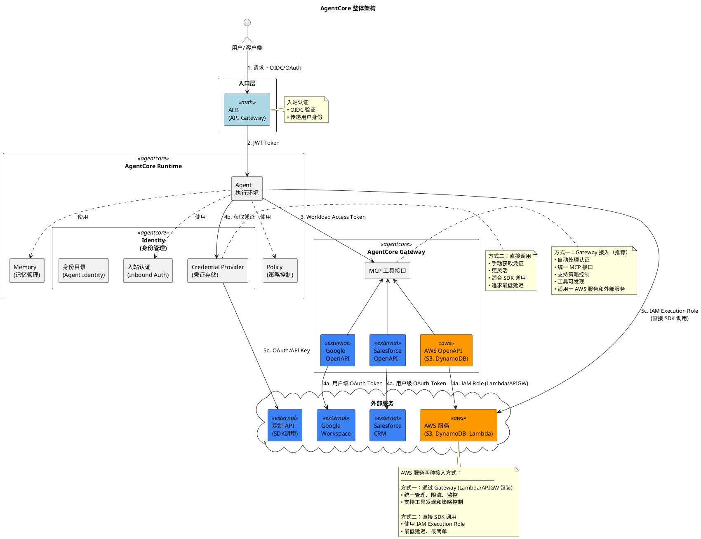
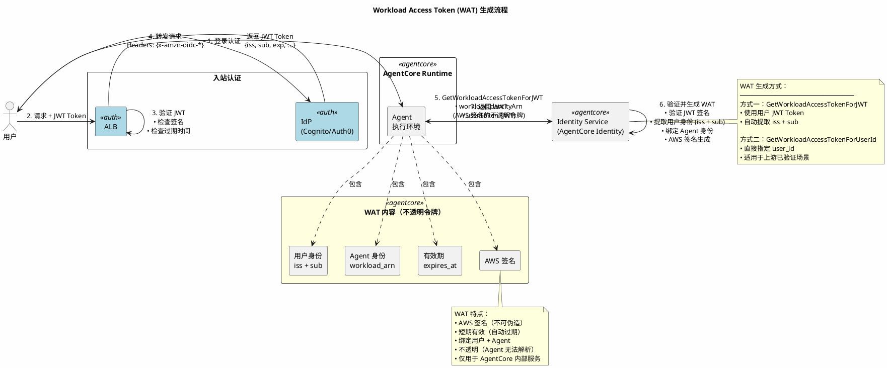

<!--more-->

## 什么是 Amazon Bedrock AgentCore

Amazon Bedrock AgentCore 是一个用于构建、部署和运营 AI Agent 的平台，支持任意框架和基础模型。AgentCore 提供了一系列模块化服务：

### 整体架构图



**认证流向说明：**

1. **用户认证**：用户 → ALB/API Gateway → OIDC 验证 → JWT Token
2. **Agent 身份**：Runtime 自动生成 Workload Access Token（绑定用户 + Agent 身份）
3. **AWS 服务（方式一）**：Agent → Gateway → Lambda/API Gateway → AWS 服务（统一管理）
4. **AWS 服务（方式二）**：Agent → 直接 SDK 调用 → AWS 服务（IAM Execution Role）
5. **外部服务（方式一）**：Agent → Gateway → 自动获取用户级 OAuth Token → 外部服务
6. **外部服务（方式二）**：Agent → Credential Provider → 获取凭证 → 直接调用
7. **MCP 工具**：Gateway 自动注入用户身份到 Headers，后台服务按用户隔离数据

**服务接入方式对比：**

| 方面 | 方式一：Gateway 接入 | 方式二：直接调用 |
|------|---------------------|-----------------|
| 认证处理 | Gateway 自动处理 | Agent 手动处理 |
| 工具发现 | ✅ 支持 | ❌ 不支持 |
| 策略控制 | ✅ Policy 可管控 | ❌ 无统一管控 |
| 监控审计 | ✅ 统一日志 | 各服务独立 |
| 延迟 | 略高（多一层） | 最低 |
| 适用场景 | 需要统一管理的服务 | 简单调用/追求性能 |

### Workload Access Token 生成流程



**WAT 生成两种模式：**

| 模式 | API | 输入 | 适用场景 |
|------|-----|------|---------|
| **JWT 模式** | `GetWorkloadAccessTokenForJWT` | 用户 JWT Token | 标准场景（推荐） |
| **User ID 模式** | `GetWorkloadAccessTokenForUserId` | user_id 字符串 | 上游已验证（如 ALB） |

**WAT 使用范围：**

```
┌─────────────────────────────────────────────────────────────────┐
│                     WAT 适用范围                                 │
├─────────────────────────────────────────────────────────────────┤
│                                                                 │
│  ✅ 可访问（AgentCore 内部服务）                                 │
│  ─────────────────────────────────────────────────────────────  │
│  • Credential Provider - 获取外部服务凭证                       │
│  • Memory Service - 用户级记忆存储                              │
│  • Gateway - MCP 工具调用                                       │
│  • 其他 AgentCore 内部端点                                      │
│                                                                 │
│  ❌ 不可访问                                                     │
│  ─────────────────────────────────────────────────────────────  │
│  • AWS 服务 (S3, DynamoDB) - 使用 IAM Execution Role            │
│  • 外部服务 (Salesforce, Google) - 使用从 CP 获取的 OAuth Token │
│  • 任何非 AgentCore 服务                                        │
│                                                                 │
└─────────────────────────────────────────────────────────────────┘
```

### AgentCore 模块化服务

| 服务 | 描述 |
|------|------|
| **Runtime** | 安全的无服务器运行时环境，专为部署和扩展动态 AI Agent 而构建 |
| **Memory** | 构建具有上下文感知能力的 Agent，支持短期和长期记忆 |
| **Gateway** | 将 API、Lambda 函数和现有服务转换为 MCP 兼容工具 |
| **Identity** | 安全、可扩展的 Agent 身份、访问和认证管理服务 |
| **Code Interpreter** | 隔离的沙箱环境，供 Agent 执行代码 |
| **Browser** | 基于云的浏览器运行时环境，使 AI Agent 能与 Web 应用交互 |
| **Observability** | 统一视图来追踪、调试和监控生产环境中的 Agent 性能 |
| **Evaluations** | 专用于自动化、一致性和数据驱动的 Agent 评估服务 |
| **Policy** | 提供确定性控制，确保 Agent 在定义的边界和业务规则内运行 |

### Runtime 和 Gateway 详解

**AgentCore Runtime** 是 Agent 的**运行环境**，负责执行 Agent 代码：
- 提供安全的无服务器执行环境
- 支持快速冷启动，适合实时交互
- 支持长时间运行的异步 Agent
- 提供会话隔离

**AgentCore Gateway** 是 Agent 的**工具桥梁**，将现有服务转换为 Agent 可用的工具：

```
┌─────────────────────────────────────────────────────────────┐
│                     AgentCore Gateway                        │
│                                                              │
│   ┌──────────────┐   ┌──────────────┐   ┌──────────────┐   │
│   │ Lambda 函数   │   │ API Gateway  │   │ OpenAPI Spec │   │
│   └──────┬───────┘   └──────┬───────┘   └──────┬───────┘   │
│          │                  │                  │            │
│          └──────────────────┼──────────────────┘            │
│                             ▼                                │
│                  ┌──────────────────────┐                   │
│                  │   MCP 兼容工具端点    │                   │
│                  │  (统一的工具接口)     │                   │
│                  └──────────┬───────────┘                   │
│                             │                                │
└─────────────────────────────┼────────────────────────────────┘
                              ▼
                    ┌─────────────────┐
                    │   AI Agent      │
                    │  (通过 MCP 调用) │
                    └─────────────────┘
```

Gateway 支持的目标类型：

| 目标类型 | 说明 |
|---------|------|
| **Lambda 函数** | 将 AWS Lambda 函数包装为 Agent 可调用的工具 |
| **API Gateway** | 连接现有的 API Gateway 端点 |
| **OpenAPI Schema** | 基于 OpenAPI 规范自动生成工具接口 |
| **Smithy Models** | AWS 的接口定义语言 |
| **MCP Servers** | 直接连接已有的 MCP 服务器 |

Gateway 的核心价值：
- **无需重写代码** - 现有的 API 和服务可以直接暴露给 Agent
- **统一协议** - 通过 MCP (Model Context Protocol) 提供标准化的工具接口
- **内置认证** - Gateway 处理入站和出站的认证授权
- **工具发现** - Agent 可以列出和搜索可用的工具

## AgentCore Identity 概述

**Amazon Bedrock AgentCore Identity** 是一个专为 AI Agent 和自动化工作负载设计的身份和凭证管理服务。它提供安全的认证、授权和凭证管理能力，使 Agent 和工具能够代表用户访问 AWS 资源和第三方服务，同时保持严格的安全控制和审计跟踪。

### 核心特性

- **集中化的 Agent 身份管理**：管理非人类身份（Agent 身份）的独特挑战
- **安全的凭证存储**：支持 OAuth 2.0、API Key 和 Sigv4 等标准化认证方式
- **与 AWS 服务无缝集成**：同时支持安全访问外部工具和服务
- **独立验证每个请求**：无论来源如何，都需要对所有访问尝试进行显式验证

### 什么时候需要 Identity？

AgentCore Identity 有两个主要用途：

**1. 入站认证（Inbound Auth）** - 验证谁在调用 Agent

即使不需要访问外部服务，如果 Agent 需要识别调用者身份，也需要 Identity：
- 多租户应用 - 不同用户看到不同的数据
- 审计需求 - 记录哪个用户执行了什么操作
- 权限控制 - 不同用户有不同的操作权限

**2. 出站认证（Outbound Auth）** - Agent 访问外部服务

当 Agent 需要代表用户访问第三方服务时，需要 Identity 来管理凭证。

**使用场景对照表：**

| 场景 | 是否需要 Identity |
|------|------------------|
| 公开的 Agent（无需登录） | ❌ 不需要 |
| 只访问 AWS 服务（S3、DynamoDB） | ❌ 不需要（用 IAM Role） |
| 需要识别调用用户身份 | ✅ 需要（入站认证） |
| 需要访问外部服务（Salesforce、Google等） | ✅ 需要（出站认证） |
| 需要按用户隔离数据 | ✅ 需要（入站+出站） |

```
┌─────────────────────────────────────────────────────────────┐
│                  AgentCore Identity 作用                     │
├─────────────────────────────────────────────────────────────┤
│                                                             │
│  入站认证(Inbound)                    出站认证(Outbound)     │
│  ┌─────────────────────┐            ┌─────────────────────┐ │
│  │ • 验证用户身份        │            │ • 访问外部服务        │ │
│  │ • 多租户隔离          │            │ • OAuth/API Key 管理 │ │
│  │ • 审计追踪            │            │ • 凭证安全存储        │ │
│  │ • 权限控制            │            │ • 按用户隔离凭证      │ │
│  └─────────────────────┘            └─────────────────────┘ │
│                                                             │
│  如果 Agent 是公开的 + 只访问 AWS 服务 → 可以不用 Identity    │
│                                                             │
└─────────────────────────────────────────────────────────────┘
```

### 与上游认证服务集成（如 ALB）

如果已经在 ALB（Application Load Balancer）或其他上游服务验证过用户身份，**不需要重复验证**，但需要正确传递用户身份信息。

**架构模式：ALB 验证 + Identity 信任**

```
用户 ──▶ ALB (OIDC 验证) ──▶ 传递用户信息 ──▶ AgentCore Runtime
                                    │
                                    ▼
                              Identity 信任 ALB 传递的身份
                                    │
                                    ▼
                              获取 Workload Access Token
```

ALB 可以将用户信息（如 `x-amzn-oidc-identity`、`x-amzn-oidc-accesstoken`）传递给后端，Identity 可以**信任**这些信息：

```python
# 从 ALB 传递的 headers 中获取用户 ID
user_id = request.headers.get("x-amzn-oidc-identity")

# 使用 user_id 模式（不需要再次验证 JWT）
workload_access_token = identity_client.get_workload_access_token(
    workload_name="my-agent",
    user_id=user_id  # 直接使用 ALB 已验证的用户 ID
)
```

**认证层次对照：**

| 场景 | 是否需要 Identity 入站验证 |
|------|---------------------------|
| ALB 已验证 + 不需要访问外部服务 | ❌ 不需要 |
| ALB 已验证 + 需要访问外部服务 | ⚠️ 需要获取 Workload Access Token（但可信任 ALB 的用户身份） |
| 无 ALB + 需要识别用户 | ✅ 需要 |
| 无 ALB + 需要访问外部服务 | ✅ 需要 |

**关键点：** Identity 的核心价值在于**出站凭证管理**（让 Agent 能安全地访问外部服务），入站验证是可选的，可以信任上游（如 ALB）已经完成的认证。

## Workload Access Token（工作负载访问令牌）

### 什么是 Workload Access Token？

Workload Access Token 是一种 AWS 签名的不透明访问令牌，使 Agent 能够访问 AgentCore 内部服务（如出站凭证提供商）。

**关键特性：**

1. **仅限内部服务** - Workload Access Token 专门用于访问 AWS AgentCore 内部服务，不能用于外部服务
2. **自动传递** - Runtime 和 Gateway 在执行期间自动向 Agent 提供这些令牌
3. **安全设计** - Runtime 管理的 Agent 身份无法直接检索 Workload Access Token，防止令牌提取和滥用
4. **用户和 Agent 身份绑定** - 令牌包含用户身份和 Agent 身份信息，用于安全的凭证访问

### 凭证作用域区分

Agent 在运行过程中可能需要访问不同类型的资源，每种资源使用不同的凭证：

| 凭证类型 | 作用域 | 用途 |
|---------|-------|------|
| **Workload Access Token** | AgentCore 内部服务 | 访问 Credential Provider、Memory 等端点 |
| **IAM Execution Role** | AWS 服务 | 访问 S3、DynamoDB、Lambda、Bedrock 等 |
| **OAuth Token / API Key** | 外部第三方服务 | 访问 Salesforce、Google、Slack 等 |

**注意：** Workload Access Token 的作用域**不包括** AWS 自身的服务（如 S3、DynamoDB）。访问 AWS 服务使用的是 Agent 的 IAM Execution Role。

```
┌─────────────────────────────────────────────────────────┐
│                    AgentCore 平台                        │
│  ┌─────────────┐    ┌──────────────────────────────┐   │
│  │   Runtime   │───▶│Workload Access Token (内部)   │   │
│  │   (Agent)   │    │                              │   │
│  └─────────────┘    │  ┌────────────────────────┐  │   │
│        │            │  │ Outbound Credential    │  │   │
│        │            │  │ Provider               │  │   │
│        │            │  └──────────┬─────────────┘  │   │
│        │            └─────────────┼────────────────┘   │
│        │                          │                    │
│        │                          ▼                    │
│        │          ┌───────────────────────────────┐    │
│        │          │   外部服务 (Salesforce, etc.)  │    │
│        │          │   使用 OAuth Token / API Key  │    │
│        │          └───────────────────────────────┘    │
│        │                                               │
│        ▼                                               │
│  ┌─────────────────────────────────────────────────┐   │
│  │           AWS 服务 (S3, DynamoDB, etc.)          │   │
│  │           使用 IAM Execution Role                │   │
│  └─────────────────────────────────────────────────┘   │
└─────────────────────────────────────────────────────────┘
```

这种设计的好处：
- **最小权限原则** - Agent 永远不直接持有外部服务的长期凭证
- **审计追踪** - 所有凭证访问都经过 AgentCore 记录
- **安全边界** - 即使 Workload Access Token 泄露，攻击者也无法直接访问外部服务

### Runtime 和 Gateway 如何自动获取令牌

当通过 AgentCore Runtime 或 Gateway 调用 Agent 时，服务会自动处理 Workload Access Token 的生成：

1. Runtime 验证入站身份提供商的 OAuth Token（发行者、签名）
2. Runtime 从 OAuth Token 中提取代表用户身份的 `iss` 和 `sub` 声明
3. Runtime 获取 Agent 关联的工作负载身份
4. Runtime 使用用户身份和 Agent 工作负载身份调用 `GetWorkloadAccessTokenForJWT`
5. Runtime 将 Workload Access Token 作为调用负载头的一部分传递给 Agent 代码

### 手动获取 Workload Access Token

根据识别 Agent 最终用户的方式，有两种获取模式：

**模式一：使用 JWT 识别最终用户（推荐）**

```python
from bedrock_agentcore.services.identity import IdentityClient

identity_client = IdentityClient("us-east-1")

# 使用调用者的 IAM 身份认证 Agent，并提供包含最终用户身份的 JWT
workload_access_token = identity_client.get_workload_access_token(
    workload_name="my-demo-agent",
    user_token="insert-jwt-here"
)
```

**模式二：使用字符串标识符识别最终用户**

```python
from bedrock_agentcore.services.identity import IdentityClient

identity_client = IdentityClient("us-east-1")

# 当没有可用的 JWT 时，使用字符串表示用户身份
workload_access_token = identity_client.get_workload_access_token(
    workload_name="my-demo-agent",
    user_id="insert-user-name-or-identifier"
)
```

### 安全控制措施

`GetWorkloadAccessTokenForUserId` API 实现了多项安全控制：

| 控制措施 | 说明 |
|---------|------|
| **工作负载身份验证** | API 验证请求身份是否有权代表指定的工作负载身份行事 |
| **服务管理身份限制** | Runtime 管理和 Gateway 管理的工作负载身份无法直接检索令牌 |
| **IAM 权限要求** | 调用者必须具有 `GetWorkloadAccessToken`、`GetWorkloadAccessTokenForUserId` 和 `GetWorkloadAccessTokenForJWT` 权限 |
| **令牌作用域** | 令牌作用于特定的用户- Agent 对，确保一个用户存储的凭证不能被另一个用户访问 |
| **用户 ID 分区** | 使用多个身份提供商时，建议使用 `provider_id+user_id` 模式分区用户 ID |

## 使用场景

1. **客户支持 AI Agent** - Agent 代表用户访问 CRM 系统
2. **工作流自动化** - Agent 自动执行跨系统的业务流程
3. **数据分析** - Agent 访问数据源并执行分析任务
4. **多 Agent 系统** - 复杂的多 Agent 协作场景中的身份管理

## Reference

- [Amazon Bedrock AgentCore Identity Documentation](https://docs.aws.amazon.com/bedrock-agentcore/latest/devguide/identity.html)
- [Get workload access token](https://docs.aws.amazon.com/bedrock-agentcore/latest/devguide/get-workload-access-token.html)
- [Overview of Amazon Bedrock AgentCore Identity](https://docs.aws.amazon.com/bedrock-agentcore/latest/devguide/identity-overview.html)

