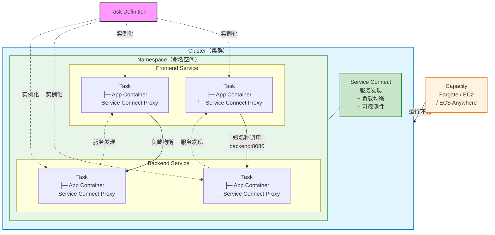
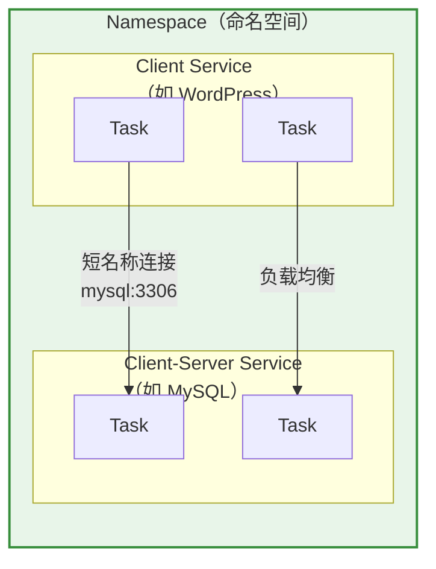

Amazon Elastic Container Service (Amazon ECS) 是 AWS 提供的完全托管式容器编排服务，帮助用户轻松部署、管理和扩展容器化应用程序。作为一项完全托管的服务，Amazon ECS 内置了 AWS 配置和运营最佳实践，与 Amazon ECR 等 AWS 工具以及 Docker 等第三方工具集成，使团队能够专注于构建应用程序，而非基础设施。

<!--more-->

## 核心概念

### 三层架构

Amazon ECS 采用三层架构：

1. **Capacity（容量层）** - 容器运行的基础设施
2. **Controller（控制层）** - 部署和管理容器上运行的应用程序
3. **Provisioning（配置层）** - 与调度器交互以部署和管理应用程序及容器的工具

## 核心组件

ECS 核心组件之间的关系如下：

### Task Definition（任务定义）

Task Definition 是应用程序的蓝图，是一个 JSON 格式的文本文件，描述了应用程序的参数和一个或多个容器。主要参数包括：

- 容器使用的 Docker 镜像
- 每个任务或容器使用的 CPU 和内存量
- 容器运行的操作系统
- 容器的 Docker 网络模式
- 日志配置
- 任务使用的 IAM 角色
- 数据卷配置

### Task（任务）

Task 是 Task Definition 在集群中的实例化。创建任务定义后，可以指定在集群上运行的任务数量。

### Service（服务）

Amazon ECS Service 在集群中同时运行和维护所需数量的任务。如果任何任务因任何原因失败或停止，Amazon ECS 服务调度器会根据任务定义启动另一个实例来替换它，从而维持服务中所需的任务数量。

### Cluster（集群）

Cluster 是运行应用程序的基础设施，是任务和服务的逻辑分组。

### Service Connect

Amazon ECS Service Connect 提供服务间通信的管理功能，它在 Amazon ECS 中同时构建了服务发现和服务网格（Service Mesh）能力。

#### 核心概念

| 概念 | 说明 |
|------|------|
| **Port Name** | 任务定义中分配给端口映射的名称 |
| **Client Alias** | 服务配置中分配的端口号和 DNS 名称 |
| **Discovery Name** | 用于创建 AWS Cloud Map 服务的可选名称 |
| **Endpoint** | 连接到服务的 URL，如 `http://blog:80`、`grpc://checkout:8080` |
| **Namespace** | 使用 AWS Cloud Map 命名空间作为服务的逻辑分组 |

#### 服务类型

- **Client Service（客户端服务）** - 运行网络客户端应用的服务，可以发现并连接到命名空间中的所有端点
- **Client-Server Service（客户端-服务器服务）** - 运行网络或 Web 服务应用的服务，可以通过端点访问，同时也能连接到其他服务

#### 架构图

#### 主要特性

- **短名称发现** - 使用简短名称（如 `mysql`）而非完整 DNS 名称连接服务
- **内置负载均衡** - 代理容器执行轮询负载均衡
- **异常检测** - 自动检测并隔离故障任务
- **重试机制** - 自动重试失败的连接
- **统一监控** - 标准化的指标和日志，可在 CloudWatch 中查看
- **TLS 加密** - 支持使用 AWS Private CA 进行流量加密

#### Namespace（命名空间）

Namespace 是使用 AWS Cloud Map 创建的服务逻辑分组，用于 Service Connect 服务发现和通信。

主要作用：
- **服务发现** - 命名空间内的服务可以通过短名称相互发现
- **逻辑隔离** - 不同命名空间的服务相互独立，可以使用相同的服务名称
- **跨集群通信** - 同一命名空间的服务可以跨越不同的 ECS 集群
- **跨账户通信** - 支持通过 AWS RAM 共享命名空间，实现跨账户服务通信

> Namespace 必须与 ECS 服务和集群位于同一 AWS 区域。

#### 配置步骤

1. **任务定义** - 为端口映射添加 `name` 字段
2. **创建命名空间** - 创建集群时指定或单独创建 AWS Cloud Map 命名空间
3. **配置服务** - 在服务中启用 Service Connect 并选择命名空间
4. **部署服务** - Amazon ECS 自动添加 Service Connect 代理容器
5. **连接端点** - 客户端应用通过短名称连接到服务端点

#### 定价

- 使用 Service Connect 无额外费用
- AWS Cloud Map 配合 Service Connect 使用时无额外费用
- 仅支付计算资源（vCPU 和内存）费用
- TLS 加密功能使用 AWS Private CA 需要单独付费

## 容量选项（Capacity Options）&& 启动类型（Launch Types）

| 启动类型 | 描述 |
|---------|------|
| Fargate | 无服务器、按需付费的计算引擎，专注于构建应用程序而无需管理服务器 |
| EC2 | 您选择实例类型、实例数量并管理容量 |
| External | Amazon ECS Anywhere，支持注册外部实例 |

Amazon ECS 支持多种容量选项：

### 1. Fargate

**Fargate** 是一种无服务器、按需付费的计算引擎。使用 Fargate，您无需管理服务器、处理容量规划或隔离容器工作负载以确保安全。

特点：
- 无需配置、配置或扩展虚拟机集群
- 每个任务都有自己的隔离边界
- 不与其他任务共享底层内核、CPU、内存或弹性网络接口
- 支持平台版本：Amazon Linux 2 (1.3.0)、Bottlerocket (1.4.0)、Windows 2019 Server

### 2. Amazon ECS Managed Instances

Amazon ECS Managed Instances 是一种计算选项，让您可以在各种 Amazon EC2 实例类型上运行容器化工作负载，同时将基础设施管理交给 AWS。AWS 处理底层基础设施的配置、补丁、扩展和维护。

特点：
- 访问特定的计算能力（GPU 加速、特定 CPU 架构、高网络性能）
- AWS 管理基础设施
- 适合需要特殊计算能力的场景

### 3. Amazon EC2 实例

您可以选择实例类型、实例数量，并自行管理容量。这提供了最大的控制灵活性。

### 4. Amazon ECS Anywhere

Amazon ECS Anywhere 支持将外部实例（如本地服务器或虚拟机）注册到 Amazon ECS 集群。

## 服务自动扩缩

Amazon ECS 支持多种自动扩缩策略：

- **目标跟踪（Target Tracking）** - 根据特定指标自动调整任务数量
- **步进扩缩（Step Scaling）** - 根据 CloudWatch 警报执行扩缩操作
- **计划扩缩（Scheduled Scaling）** - 按计划时间执行扩缩操作
- **预测性扩缩（Predictive Scaling）** - 基于历史数据预测负载并自动扩缩

## 部署策略

### Rolling Update（滚动更新）

滚动更新是默认的部署类型，逐步用新任务替换旧任务。

### Blue/Green Deployment（蓝绿部署）

蓝绿部署创建一组新的任务（绿色），验证通过后切换流量，然后终止旧任务（蓝色）。支持通过 Application Load Balancer 和 Network Load Balancer 实现。

### Linear Deployment（线性部署）

线性部署逐步增加新版本任务的流量百分比。

### Canary Deployment（金丝雀部署）

金丝雀部署先将少量流量导向新版本，然后逐步增加。

## 网络模式

### awsvpc 模式

- 推荐用于 Fargate 和 ECS Managed Instances
- 每个任务获得自己的弹性网络接口
- 提供最佳的网络隔离

### host 模式

- 任务使用主机实例的网络接口
- 适用于需要高性能网络的场景

### bridge 模式

- 使用 Docker 内置虚拟网络
- 仅适用于 EC2 启动类型

## 存储选项

Amazon ECS 任务支持多种存储选项：

- **Amazon EBS** - 块存储，支持加密
- **Amazon EFS** - 文件存储，适合共享存储
- **FSx for Windows File Server** - Windows 容器文件存储
- **Docker Volumes** - Docker 卷
- **Bind Mounts** - 绑定挂载

### ECS Exec

允许在运行的容器中执行命令，便于调试和故障排除。

## Reference

- [Amazon ECS Documentation](https://docs.aws.amazon.com/ecs/)
- [Amazon ECS Developer Guide](https://docs.aws.amazon.com/AmazonECS/latest/developerguide/Welcome.html)
- [AWS Fargate for Amazon ECS](https://docs.aws.amazon.com/AmazonECS/latest/developerguide/AWS_Fargate.html)
- [Service Connect Overview](https://docs.aws.amazon.com/AmazonECS/latest/developerguide/service-connect.html)
- [Service Connect Configuration](https://docs.aws.amazon.com/AmazonECS/latest/developerguide/service-connect-concepts.html)
