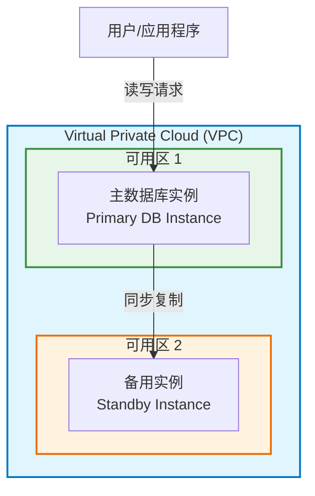
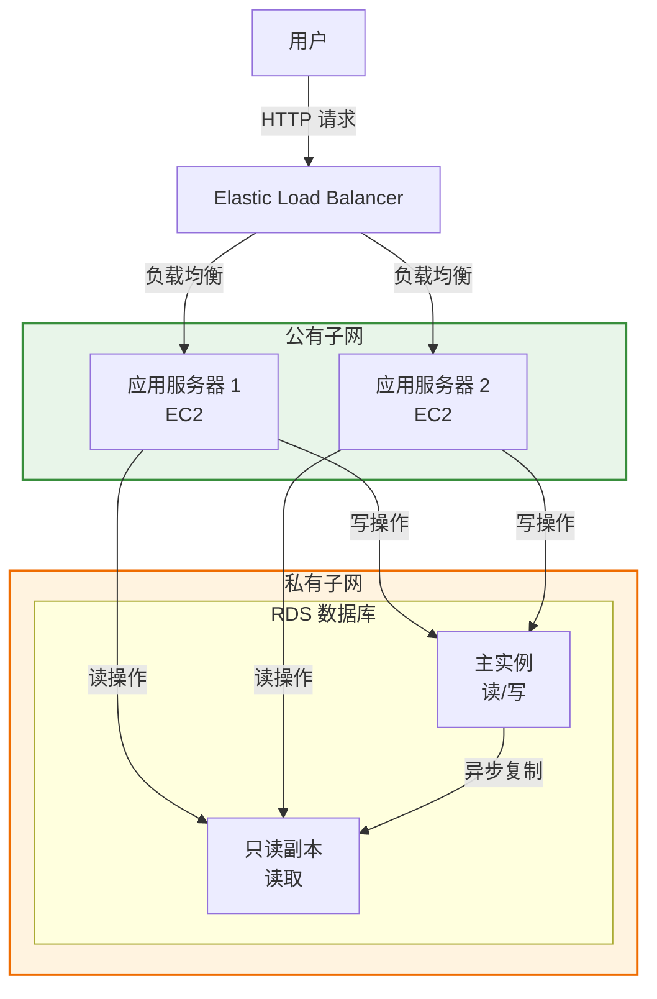
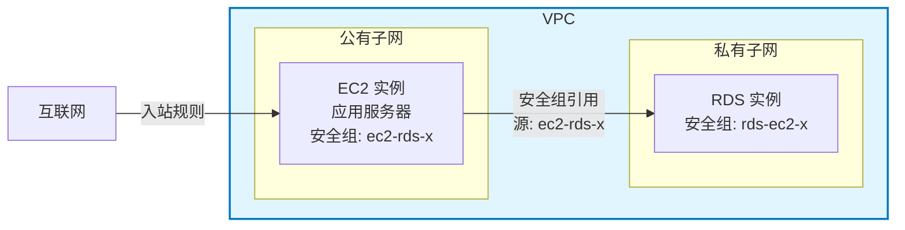
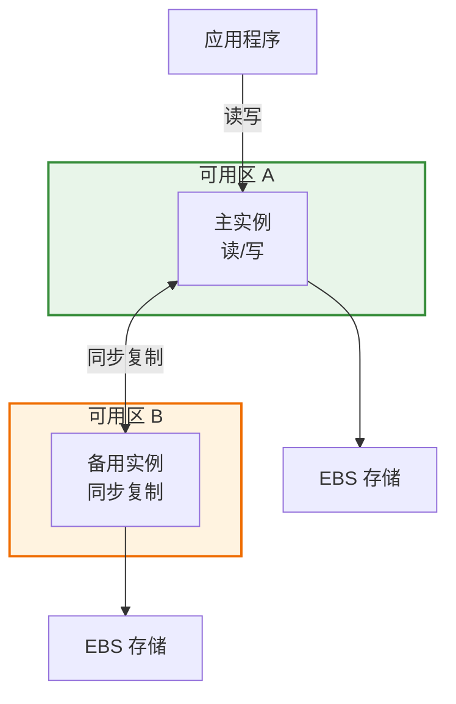
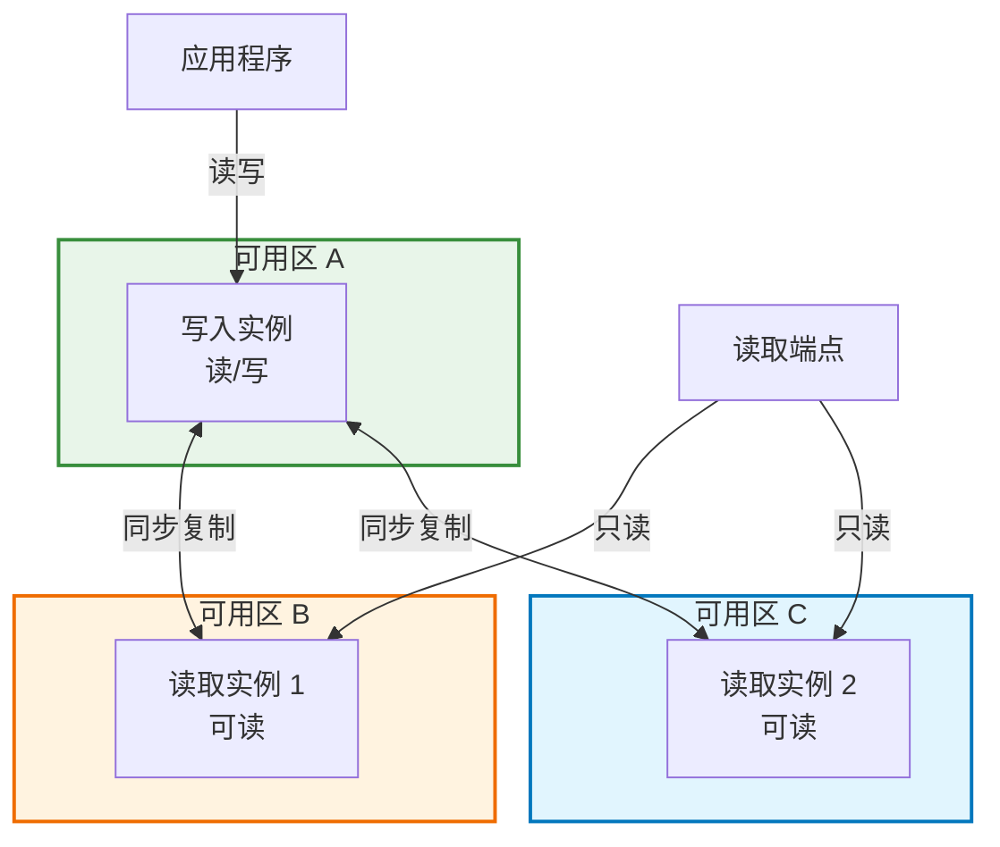
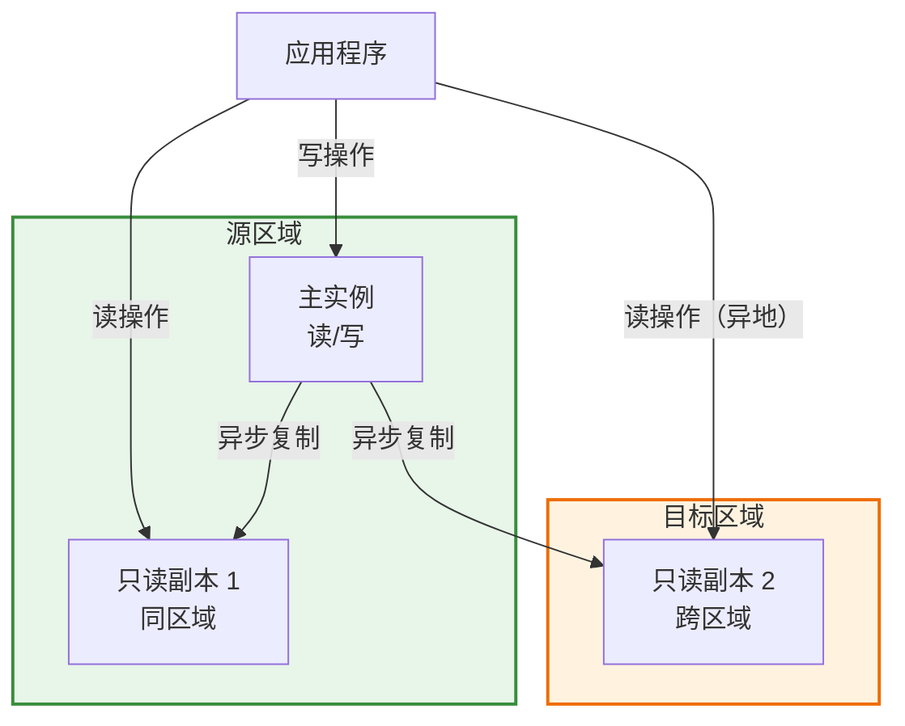

Amazon Relational Database Service (Amazon RDS) 是 AWS 提供的完全托管式关系型数据库服务，让用户能够在 AWS 云端轻松设置、运行和扩展关系型数据库。作为一项托管服务，Amazon RDS 负责大部分数据库管理任务，让用户能够专注于应用程序和用户，而非基础设施管理。

<!--more-->

## 1. 什么是 Amazon RDS

### 服务定义

Amazon RDS 是一种 Web 服务，为业界标准的关系型数据库提供经济高效、可调整大小的容量。它自动处理耗时的数据库管理任务，如备份、软件修补、故障检测和恢复等。

### 核心优势

相比自建数据库或使用 EC2 部署数据库，Amazon RDS 提供以下主要优势：

| 特性 | 本地部署 | EC2 管理 | RDS 管理 |
|------|---------|----------|----------|
| 应用优化 | 客户负责 | 客户负责 | 客户负责 |
| 扩展 | 客户负责 | 客户负责 | AWS 负责 |
| 高可用性 | 客户负责 | 客户负责 | AWS 负责 |
| 数据库备份 | 客户负责 | 客户负责 | AWS 负责 |
| 数据库软件补丁 | 客户负责 | 客户负责 | AWS 负责 |
| 数据库软件安装 | 客户负责 | 客户负责 | AWS 负责 |
| 操作系统补丁 | 客户负责 | 客户负责 | AWS 负责 |
| 操作系统安装 | 客户负责 | 客户负责 | AWS 负责 |
| 服务器维护 | 客户负责 | AWS 负责 | AWS 负责 |
| 硬件生命周期 | 客户负责 | AWS 负责 | AWS 负责 |
| 电力、网络和散热 | 客户负责 | AWS 负责 | AWS 负责 |

### 支持的数据库引擎

Amazon RDS 支持以下主流数据库引擎：

- **MySQL** - 开源关系型数据库
- **PostgreSQL** - 功能强大的开源对象关系型数据库
- **MariaDB** - MySQL 的社区开发分支
- **Microsoft SQL Server** - 微软企业级数据库
- **Oracle Database** - 甲骨文企业级数据库
- **IBM Db2** - IBM 企业级数据库

### DB 实例（DB Instance）

**DB 实例**是 AWS 云中的隔离数据库环境，是 Amazon RDS 的基本构建块。一个 DB 实例可以包含一个或多个用户创建的数据库。



### DB 实例类

DB 实例类决定实例的计算和内存容量：

| 实例类类型 | 前缀 | 说明 |
|-----------|------|------|
| 通用型 | db.m* | 平衡计算、内存和网络资源 |
| 内存优化型 | db.r*, db.x*, db.z* | 适合内存密集型工作负载 |
| 计算优化型 | db.c* | 适合计算密集型工作负载 |
| 突发性能型 | db.t* | 适合间歇性工作负载，可突发 CPU |

### 存储类型

Amazon RDS 提供以下存储类型：

- **通用型 SSD (gp2/gp3)** - 成本效益高，适合广泛的工作负载，特别适合开发和测试环境
- **预置 IOPS SSD (io1/io2)** - 为 I/O 密集型工作负载设计，提供低延迟和一致的 I/O 吞吐量，适合生产环境
- **磁性存储** - 为向后兼容而支持，不推荐用于新部署

## 2. 有什么用及使用场景

### 主要用途

1. **消除繁琐的数据库管理任务** - 自动处理备份、补丁、故障检测和恢复
2. **提供高可用性和数据冗余** - 通过 Multi-AZ 部署实现故障转移支持
3. **实现弹性扩展** - 支持读写分离和水平扩展
4. **简化安全合规** - 集成 IAM、VPC 等安全机制
5. **降低运维成本** - 无需专职 DBA 团队管理基础设施

### 典型使用场景

#### 场景一：Web 和移动应用程序后端



这是最常见的 RDS 使用场景：
- 动态网站内容存储
- 用户会话管理
- 事务处理
- 通过只读副本分担读取压力

#### 场景二：企业应用系统

- **ERP 系统** - 存储 ERP 应用数据，利用高可用性保证业务连续性
- **CRM 系统** - 客户关系数据管理
- **电商系统** - 商品、订单、库存数据管理

#### 场景三：数据分析和报告

- 配合只读副本进行数据分析，不影响主库性能
- 业务报表生成
- 数据仓库的数据源

#### 场景四：开发测试环境

- 快速创建开发/测试数据库
- 使用快照快速恢复到特定状态
- 利用 AWS Free Tier 降低成本

### 适用与不适用场景

**适合使用 RDS 的场景：**
- 需要关系型数据库的传统应用
- 需要复杂事务和 JOIN 操作
- 数据结构相对稳定
- 需要强一致性保证
- 运维资源有限的团队

**不适合使用 RDS 的场景：**
- 需要数据库级别的高度定制化（如自定义扩展、特定版本）
- 需要超级用户权限
- 超大规模数据需要分片（考虑 Amazon Aurora 或 DynamoDB）
- NoSQL 数据模型（考虑 DynamoDB、DocumentDB）
- 需要操作系统级别访问（考虑 EC2 自建）

## 3. 如何使用 Amazon RDS

### 基本使用步骤

#### 步骤 1：创建数据库实例

**通过 AWS 管理控制台创建：**

1. 登录 AWS 管理控制台，打开 [Amazon RDS 控制台](https://console.aws.amazon.com/rds/)
2. 点击"创建数据库"
3. 选择创建方式：
   - **标准创建** - 完整配置选项
   - **轻松创建** - 快速创建，使用默认设置
4. 选择引擎类型（MySQL、PostgreSQL 等）
5. 选择模板：
   - **生产环境** - 高可用配置
   - **开发/测试** - 成本优化配置
6. 配置实例：
   - DB 实例标识符
   - 主用户名和密码
   - DB 实例类
   - 存储类型和大小
7. 配置连接：
   - VPC
   - 子网组
   - 安全组
8. 配置其他选项：
   - 备份保留期
   - 维护窗口
   - 参数组

**通过 AWS CLI 创建：**

```bash
aws rds create-db-instance \
    --db-instance-identifier mydb \
    --db-instance-class db.t3.micro \
    --engine mysql \
    --master-username admin \
    --master-user-password MyPassword123 \
    --allocated-storage 20 \
    --vpc-security-group-ids sg-12345678
```

#### 步骤 2：连接数据库

创建完成后，获取数据库终端节点（Endpoint），使用标准数据库客户端连接：

**MySQL 连接示例：**

```bash
mysql -h mydb.xxxxx.us-east-1.rds.amazonaws.com \
      -P 3306 \
      -u admin \
      -p
```

**PostgreSQL 连接示例：**

```bash
psql -h mydb.xxxxx.us-east-1.rds.amazonaws.com \
     -U admin \
     -d mydb
```

**通过 EC2 实例连接：**

最佳实践是将 EC2 应用服务器和 RDS 放在同一 VPC 中，通过安全组控制访问：



#### 步骤 3：数据库基本操作

连接后，可以执行标准的 SQL 操作：

```sql
-- 创建数据库
CREATE DATABASE myapp;

-- 创建表
CREATE TABLE users (
    id INT AUTO_INCREMENT PRIMARY KEY,
    username VARCHAR(50) NOT NULL,
    email VARCHAR(100) NOT NULL,
    created_at TIMESTAMP DEFAULT CURRENT_TIMESTAMP
);

-- 插入数据
INSERT INTO users (username, email) VALUES ('john', 'john@example.com');

-- 查询数据
SELECT * FROM users;
```

#### 步骤 4：监控和维护

使用以下工具监控数据库：

- **Amazon CloudWatch** - 查看性能指标
- **Performance Insights** - 分析数据库负载
- **Enhanced Monitoring** - 实时操作系统指标
- **数据库日志** - 查看错误日志、慢查询日志

### 定价模型

Amazon RDS 提供两种定价模式：

| 模式 | 说明 | 适用场景 |
|------|------|----------|
| 按需实例 | 按小时计费，无长期承诺 | 开发测试、短期项目、不可预测的工作负载 |
| 预留实例 | 承诺 1-3 年，享受折扣 | 长期稳定的生产工作负载 |

**AWS Free Tier：**
- 支持 MySQL、PostgreSQL、MariaDB、SQL Server Express
- 可使用 db.t3.micro 或 db.t4g.micro 实例
- 每月 750 小时免费使用（12 个月内）

## 4. 常用特性

### Multi-AZ 部署（高可用）

Multi-AZ 部署提供高可用性和故障转移支持。

#### Multi-AZ 单实例部署



**特点：**
- 一个主实例 + 一个备用实例（不同可用区）
- 同步复制到备用实例
- 故障时自动切换（通常 35 秒内）
- 备用实例不可读取

#### Multi-AZ 数据库集群部署



**特点：**
- 一个写入实例 + 两个读取实例（三个不同可用区）
- 所有实例都可以处理读取请求
- 提供独立的读取端点
- 高达 2 倍的读取扩展能力
- 故障转移更快更可靠

### 只读副本（Read Replicas）

只读副本用于提高读取性能和数据可用性。



**主要用途：**
- **读取扩展** - 将读取流量分流到副本，减轻主实例压力
- **跨区域灾难恢复** - 在不同 AWS 区域创建副本
- **数据分析** - 在副本上运行分析查询，不影响生产系统
- **数据迁移** - 将副本提升为独立实例

**限制：**
- 每个主实例最多支持 5 个只读副本
- 存在复制延迟（异步复制）
- 只读副本不支持写操作

**创建只读副本：**

```bash
aws rds create-db-instance-read-replica \
    --db-instance-identifier myreadreplica \
    --source-db-instance-identifier arn:aws:rds:us-east-1:123456789012:db:mydb
```

### 备份与恢复

Amazon RDS 提供两种备份方式：

#### 自动备份

| 特性 | 说明 |
|------|------|
| 自动执行 | 按配置的备份窗口自动执行 |
| 时间点恢复 | 支持恢复到任意时间点（PITR） |
| 保留期 | 1-35 天可配置 |
| 存储位置 | 自动存储在 S3 |
| 费用 | 与数据库存储大小相同空间免费 |

**工作原理：**
1. 在备份窗口期间创建完整快照
2. 持续捕获事务日志
3. 通过快照 + 事务日志实现时间点恢复

#### 手动快照

| 特性 | 说明 |
|------|------|
| 手动触发 | 用户主动创建 |
| 永久保留 | 除非手动删除 |
| 跨区域复制 | 支持复制到其他区域 |
| 跨账户共享 | 支持与其它 AWS 账户共享 |

**创建快照：**

```bash
# 创建手动快照
aws rds create-db-snapshot \
    --db-snapshot-identifier mydb-snapshot-20260318 \
    --db-instance-identifier mydb

# 复制快照到其他区域
aws rds copy-db-snapshot \
    --source-db-snapshot-identifier arn:aws:rds:us-east-1:123456789012:snapshot:mydb-snapshot \
    --target-db-snapshot-identifier mydb-snapshot-copy \
    --source-region us-east-1 \
    --region us-west-2
```

#### 从备份恢复

```bash
# 从快照恢复
aws rds restore-db-instance-from-db-snapshot \
    --db-instance-identifier mydb-restored \
    --db-snapshot-identifier mydb-snapshot-20260318

# 时间点恢复
aws rds restore-db-instance-to-point-in-time \
    --source-db-instance-identifier mydb \
    --target-db-instance-identifier mydb-pitr \
    --restore-time 2026-03-18T10:00:00Z
```

#### 备份最佳实践

1. **生产环境启用自动备份** - 设置适当的保留期（建议 7 天以上）
2. **关键操作前创建手动快照** - 如版本升级、架构变更
3. **跨区域复制** - 灾难恢复场景
4. **定期测试恢复流程** - 确保备份可用
5. **使用 AWS Backup** - 统一管理备份策略

### 安全性

#### 网络安全

- **VPC 部署** - 数据库部署在 VPC 私有子网中
- **安全组** - 控制入站和出站流量
- **网络 ACL** - 子网级别的访问控制

#### 访问控制

- **IAM 数据库认证** - 使用 IAM 角色连接数据库
- **主用户凭证** - 创建时设置
- **Secrets Manager** - 自动轮换数据库凭证

#### 数据加密

| 加密类型 | 说明 |
|---------|------|
| 静态加密 | 使用 KMS 加密存储数据、备份、快照、日志 |
| 传输加密 | 使用 SSL/TLS 加密数据库连接 |
| 透明数据加密 (TDE)** | SQL Server 和 Oracle 支持 |

**启用加密：**

```bash
aws rds create-db-instance \
    --db-instance-identifier mydb \
    --storage-encrypted \
    --kms-key-id arn:aws:kms:us-east-1:123456789012:key/12345678-1234-1234-1234-123456789012
    # ... 其他参数
```

### 监控与性能

#### CloudWatch 指标

RDS 自动将指标发送到 CloudWatch：

| 关键指标 | 说明 |
|---------|------|
| CPUUtilization | CPU 使用率 |
| FreeableMemory | 可用内存 |
| FreeStorageSpace | 可用存储空间 |
| ReadIOPS/WriteIOPS | I/O 操作数 |
| ReadLatency/WriteLatency | I/O 延迟 |
| DatabaseConnections | 数据库连接数 |

#### Performance Insights

Amazon RDS Performance Insights 是数据库性能调优和监控工具：

- 可视化数据库负载
- 识别瓶颈 SQL 查询
- 分析等待事件
- 查看会话信息

#### Enhanced Monitoring

实时操作系统指标监控：

- CPU 使用明细
- 内存使用
- 文件系统
- 网络流量
- 进程列表

### 自动维护

#### 自动软件补丁

- AWS 自动应用数据库引擎补丁
- 可配置维护窗口
- 支持延迟补丁应用

#### 自动小版本升级

- 自动升级到新的小版本
- 可选择启用或禁用

### 参数组

参数组用于管理数据库引擎配置：

```bash
# 创建自定义参数组
aws rds create-db-parameter-group \
    --db-parameter-group-name my-custom-params \
    --db-parameter-group-family mysql8.0 \
    --description "Custom MySQL parameters"

# 修改参数
aws rds modify-db-parameter-group \
    --db-parameter-group-name my-custom-params \
    --parameters "ParameterName=max_connections,ParameterValue=500,ApplyMethod=immediate"
```

### 存储 autoscaling

当数据库存储空间不足时，RDS 可自动扩展存储：

- 启用 Storage Autoscaling
- 设置最大存储限制
- 自动扩展不会导致停机

## Reference

- [Amazon RDS 官方文档](https://docs.aws.amazon.com/AmazonRDS/latest/UserGuide/Welcome.html)
- [Amazon RDS 入门指南](https://docs.aws.amazon.com/zh_cn/AmazonRDS/latest/UserGuide/CHAP_GettingStarted.html)
- [Amazon RDS Multi-AZ 部署](https://aws.amazon.com/rds/features/multi-az/)
- [Amazon RDS 只读副本](https://aws.amazon.com/rds/features/read-replicas/)
- [Amazon RDS 备份功能](https://aws.amazon.com/cn/rds/features/backup/)
- [创建 Amazon RDS 数据库实例](https://docs.aws.amazon.com/zh_cn/AmazonRDS/latest/UserGuide/USER_CreateDBInstance.html)
- [AWS Backup 支持 RDS Multi-AZ 集群](https://aws.amazon.com/about-aws/whats-new/2026/03/aws-backup-expands-amazon-rds-multi-az-clusters-17-regions/)
