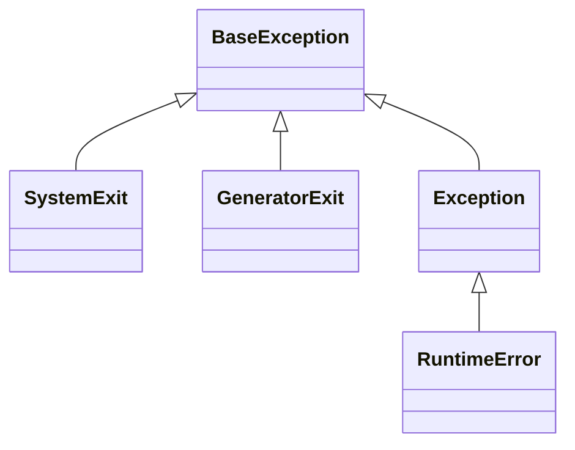

Python 语言特性梳理

<!--more-->

## 类型系统

Python 是一门动态类型语言，其类型系统的特点

1. **动态类型**：变量不需要声明类型，可以指向任何类型的对象
2. **强类型**：不同类型之间不会自动转换（除了数值类型）
3. **鸭子类型**：关注对象的行为而非类型，即**面向接口编程**
4. **渐进式类型**：可以选择性地添加类型提示，不影响运行时行为

### 基本类型

Python 内置了以下基本类型：

| 类型 | 说明 | 示例 |
|------|------|------|
| `int` | 整数，无精度限制 | `42`, `-7`, `0` |
| `float` | 浮点数，双精度 | `3.14`, `-0.001`, `1e-10` |
| `bool` | 布尔值，`int` 的子类 | `True`, `False` |
| `str` | 字符串，Unicode 文本 | `'hello'`, `"world"` |
| `bytes` | 字节序列 | `b'hello'` |
| `NoneType` | 空值类型 | `None` |

```python
# 基本类型示例
x: int = 42
y: float = 3.14
flag: bool = True
name: str = "Python"
data: bytes = b"data"
nothing: None = None
```

### 类型提示

Python 3.6+ 支持变量注解语法，PEP 526 引入了这种语法：

```python
# 变量注解
name: str = "Alice"
age: int = 30
height: float = 1.75

# 列表和字典注解
from typing import List, Dict

scores: List[int] = [90, 85, 95]
person: Dict[str, str] = {"name": "Bob", "city": "Beijing"}
```

### 字符串 (String)

字符串是**不可变**的字符序列：

```python
text = "Hello, World!"

# 字符串操作
print(text[0])           # 'H'
print(text[7:12])        # 'World'
print(text.lower())      # 'hello, world!'
print(text.upper())      # 'HELLO, WORLD!'
print(text.split(', '))  # ['Hello', 'World!']
print('-'.join(['a', 'b', 'c']))  # 'a-b-c'

# 格式化字符串
name = "Alice"
age = 30
print(f"Name: {name}, Age: {age}")  # f-string
print("Name: {}, Age: {}".format(name, age))
```

### 类 && 接口

TODO

#### 数据类 (dataclass)

`dataclass` 是 Python 3.7+ 引入的装饰器，用于简化类的定义：

```python
from dataclasses import dataclass
from typing import List

@dataclass
class Person:
    name: str
    age: int
    emails: List[str] = None

    def __post_init__(self):
        if self.emails is None:
            self.emails = []

# 使用
person = Person("Alice", 30)
print(person)  # Person(name='Alice', age=30, emails=[])
```

### 类型判断与检查

运行时类型判断：

```python
# 使用 type() 获取类型
print(type(42))          # <class 'int'>
print(type([]))          # <class 'list'>

# 使用 isinstance() 检查类型
if isinstance(x, (int, float)):
    print("x is a number")

# 使用 issubclass() 检查继承关系
print(issubclass(bool, int))  # True
```

### 特殊类型

#### Callable 类型

使用 `Callable` 表示可调用对象：

```python
from typing import Callable

def apply(func: Callable[[int, int], int], x: int, y: int) -> int:
    return func(x, y)

def add(a: int, b: int) -> int:
    return a + b

result = apply(add, 3, 5)  # result = 8
```

#### NoReturn 类型

`NoReturn` 用于表示永远不会正常返回的函数：

```python
from typing import NoReturn

def raise_error() -> NoReturn:
    raise ValueError("This function never returns")

def exit_program() -> NoReturn:
    import sys
    sys.exit(1)
```

## 容器

Python 提供了丰富的容器类型，用于存储和组织数据。

### 序列类型

序列是 Python 中最基本的数据结构，按照**顺序存储**元素。

#### 列表 (List)

列表是**可变**序列，用方括号 `[]` 表示：

```python
# 创建列表
numbers = [1, 2, 3, 4, 5]
fruits = ['apple', 'banana', 'orange']
mixed = [1, 'hello', 3.14, True]

# 列表操作
numbers.append(6)        # 添加元素
numbers.insert(0, 0)     # 在指定位置插入
numbers.extend([7, 8])   # 扩展列表
x = numbers.pop()        # 弹出最后一个元素
numbers.remove(3)        # 移除指定元素
numbers[0] = 10          # 修改元素

# 切片操作
print(numbers[1:4])      # [2, 3, 4]
print(numbers[:3])       # [10, 2, 3]
print(numbers[::2])      # 每隔一个元素
print(numbers[::-1])     # 反转列表
```

#### 使用数组代替列表

使用数组代替列表可以更节省内存空间。

```python
import array

# 列表：每个元素都是完整的 Python 对象
list_nums = [1, 2, 3, 4, 5]

# 数组：紧凑的 C 类型数组
arr_nums = array.array('i', [1, 2, 3, 4, 5])

print(sys.getsizeof(list_nums))  # 更大
print(sys.getsizeof(arr_nums))   # 更小
```

#### 元组 (Tuple)

元组是**不可变**序列，用圆括号 `()` 表示：

```python
# 创建元组
coordinates = (3, 4)
single = (42,)           # 单元素元组需要逗号
empty = ()

# 元组拆包
x, y = coordinates       # x=3, y=4

# 命名元组
from collections import namedtuple
Point = namedtuple('Point', ['x', 'y'])
p = Point(11, 22)
print(p.x, p.y)          # 11 22

# 类型化命名元组 (Python 3.6+)
from typing import NamedTuple
class Point(NamedTuple):
    x: float
    y: float

p = Point(1.5, 2.5)
```

### 字典 (Dict)

字典是**键值对的集合**，用花括号 `{}` 表示：

```python
# 创建字典
person = {
    'name': 'Alice',
    'age': 30,
    'city': 'Beijing'
}

# 字典操作
print(person['name'])              # 访问元素
print(person.get('email', 'N/A'))  # 安全访问
person['email'] = 'alice@example.com'  # 添加元素
person['age'] = 31                 # 更新元素
del person['city']                 # 删除元素

# 字典方法
print(person.keys())               # dict_keys(['name', 'age', 'email'])
print(person.values())             # dict_values(['Alice', 31, 'alice@example.com'])
print(person.items())              # dict_items([...])

# 字典推导式
squares = {x: x**2 for x in range(6)}
# {0: 0, 1: 1, 2: 4, 3: 9, 4: 16, 5: 25}

# 合并字典 (Python 3.9+)
dict1 = {'a': 1, 'b': 2}
dict2 = {'c': 3, 'd': 4}
merged = dict1 | dict2  # {'a': 1, 'b': 2, 'c': 3, 'd': 4}
```

#### defaultdict

`defaultdict` 在访问不存在的键时返回默认值：

```python
from collections import defaultdict

# 默认值为列表
dd = defaultdict(list)
dd['fruits'].append('apple')
dd['fruits'].append('banana')
# 无需预先创建列表

# 默认值为整数
counter = defaultdict(int)
counter['apple'] += 1
counter['banana'] += 2
```

### 集合类型

集合是**无序不重复**元素的集合，用花括号 `{}` 表示：

```python
# 创建集合
numbers = {1, 2, 3, 4, 5}
fruits = set(['apple', 'banana', 'orange'])

# 集合操作
numbers.add(6)            # 添加元素
numbers.discard(3)        # 删除元素（不存在也不报错）
numbers.remove(4)         # 删除元素（不存在会报错）

# 集合运算
a = {1, 2, 3, 4}
b = {3, 4, 5, 6}

print(a | b)              # 并集: {1, 2, 3, 4, 5, 6}
print(a & b)              # 交集: {3, 4}
print(a - b)              # 差集: {1, 2}
print(a ^ b)              # 对称差集: {1, 2, 5, 6}

# 集合推导式
squares = {x**2 for x in range(6)}
# {0, 1, 4, 9, 16, 25}
```

### 迭代器

TODO

### 生成器

```python
# 列表：一次性创建所有元素，占用大量内存
def get_squares_list(n):
    return [i**2 for i in range(n)]

# 生成器：惰性求值，节省内存
def get_squares_gen(n):
    for i in range(n):
        yield i**2

# 使用生成器表达式
sum_of_squares = sum(i**2 for i in range(1000000))
```

## 常用语法以及操作

### 推导式与生成器表达式

#### 列表推导式

列表推导式提供简洁的方式创建列表：

```python
# 基本语法
numbers = [x for x in range(10)]
# [0, 1, 2, 3, 4, 5, 6, 7, 8, 9]

# 带条件过滤
evens = [x for x in range(10) if x % 2 == 0]
# [0, 2, 4, 6, 8]

# 带表达式
squares = [x**2 for x in range(6)]
# [0, 1, 4, 9, 16, 25]

# 嵌套循环
matrix = [[i*j for j in range(3)] for i in range(3)]
# [[0, 0, 0], [0, 1, 2], [0, 2, 4]]

# 笛卡儿积
colors = ['black', 'white']
sizes = ['S', 'M', 'L']
tshirts = [(c, s) for c in colors for s in sizes]
# [('black', 'S'), ('black', 'M'), ('black', 'L'),
#  ('white', 'S'), ('white', 'M'), ('white', 'L')]
```

#### 生成器表达式

生成器表达式不创建列表，而是生成一个生成器对象，使用**圆括号**，节省内存：

```python
# 语法类似列表推导式，但使用圆括号
gen = (x**2 for x in range(10))

# 使用生成器
for val in gen:
    print(val)

# 作为函数参数
sum_of_squares = sum(x**2 for x in range(10))

# 与其他函数配合
max_value = max(x**2 for x in range(10))
```

#### 字典和集合推导式

```python
# 字典推导式
word_lengths = {word: len(word) for word in ['apple', 'banana', 'cherry']}
# {'apple': 5, 'banana': 6, 'cherry': 6}

# 交换键值
inverted = {v: k for k, v in word_lengths.items()}
# {5: 'apple', 6: 'banana'}

# 集合推导式
unique_lengths = {len(word) for word in ['apple', 'banana', 'cherry']}
# {5, 6}
```

### 序列拆包

#### 基本拆包

```python
# 元组拆包
a, b, c = (1, 2, 3)

# 列表拆包
x, y, z = [10, 20, 30]

# 交换变量
a, b = b, a

# 使用 * 获取余下项
first, *rest = [1, 2, 3, 4, 5]
# first=1, rest=[2, 3, 4, 5]

*head, last = [1, 2, 3, 4, 5]
# head=[1, 2, 3, 4], last=5

first, *middle, last = [1, 2, 3, 4, 5]
# first=1, middle=[2, 3, 4], last=5
```

#### 嵌套拆包

```python
# 嵌套序列拆包
(a, b), (c, d) = (1, 2), (3, 4)
# a=1, b=2, c=3, d=4

# 复杂嵌套
person = ('Alice', [20, 'Python'])
name, (age, language) = person
# name='Alice', age=20, language='Python'
```

#### 在函数调用中使用拆包

```python
# 列表拆包
numbers = [1, 2, 3]
print(*numbers)  # 等价于 print(1, 2, 3)

# 字典拆包
def greet(name, age):
    print(f"Name: {name}, Age: {age}")

person = {'name': 'Bob', 'age': 25}
greet(**person)  # 等价于 greet(name='Bob', age=25)

# 合并列表
list1 = [1, 2]
list2 = [3, 4]
combined = [*list1, *list2]  # [1, 2, 3, 4]

# 合并字典
dict1 = {'a': 1}
dict2 = {'b': 2}
merged = {**dict1, **dict2}  # {'a': 1, 'b': 2}
```

### 切片操作

```python
# 基本切片
seq = [0, 1, 2, 3, 4, 5, 6, 7, 8, 9]
print(seq[2:5])      # [2, 3, 4]
print(seq[:5])       # [0, 1, 2, 3, 4]
print(seq[5:])       # [5, 6, 7, 8, 9]
print(seq[::2])      # [0, 2, 4, 6, 8]
print(seq[::-1])     # [9, 8, 7, 6, 5, 4, 3, 2, 1, 0]

# 切片对象
slice_obj = slice(2, 5, 2)
print(seq[slice_obj])  # [2, 4]

# 为切片赋值
seq[2:5] = [20, 30, 40]
# [0, 1, 20, 30, 40, 5, 6, 7, 8, 9]

# 删除切片
del seq[2:5]
# [0, 1, 5, 6, 7, 8, 9]
```

### 条件表达式

```python
# 三元表达式
value = 10
result = "positive" if value > 0 else "non-positive"

# 嵌套条件
age = 25
category = "child" if age < 13 else "teen" if age < 20 else "adult"
```

### 循环

#### for 循环

```python
# 遍历序列
for item in [1, 2, 3]:
    print(item)

# 使用 enumerate 获取索引
for index, value in enumerate(['a', 'b', 'c']):
    print(index, value)

# 遍历字典
for key, value in person.items():
    print(key, value)

# 使用 zip 同时遍历多个序列
names = ['Alice', 'Bob', 'Charlie']
ages = [25, 30, 35]
for name, age in zip(names, ages):
    print(f"{name}: {age}")

# 使用 reversed 反向遍历
for item in reversed([1, 2, 3]):
    print(item)

# 使用 sorted 排序后遍历
for item in sorted([3, 1, 2]):
    print(item)
```

#### while 循环

```python
count = 0
while count < 5:
    print(count)
    count += 1

# while-else
count = 0
while count < 5:
    count += 1
else:
    print("Loop completed")  # 循环正常结束时执行
```

### 模式匹配 (Python 3.10+)

```python
# 结构模式匹配
match value:
    case 1:
        print("One")
    case 2 | 3:
        print("Two or three")
    case _:
        print("Something else")

# 序列模式
def describe_point(point):
    match point:
        case (0, 0):
            return "Origin"
        case (x, 0):
            return f"X-axis at {x}"
        case (0, y):
            return f"Y-axis at {y}"
        case (x, y):
            return f"Point at ({x}, {y})"

# 字典模式
def handle_config(config):
    match config:
        case {'type': 'user', 'name': name}:
            return f"User: {name}"
        case {'type': 'admin', 'name': name, 'permissions': perms}:
            return f"Admin {name} with {perms}"
        case _:
            return "Unknown config"

# 类模式
@dataclass
class Point:
    x: float
    y: float

def greet(point):
    match point:
        case Point(x=0, y=0):
            return "At origin"
        case Point(x=x, y=y):
            return f"At ({x}, {y})"
```

### 函数定义

```python
# 基本函数
def greet(name):
    return f"Hello, {name}!"

# 默认参数
def greet(name, greeting="Hello"):
    return f"{greeting}, {name}!"

# 可变位置参数 (*args)
def sum_all(*args):
    return sum(args)

# 可变关键字参数 (**kwargs)
def print_info(**kwargs):
    for key, value in kwargs.items():
        print(f"{key}: {value}")

# 仅限位置参数 (Python 3.8+)
def func(a, b, /, c, d, *, e, f):
    # a, b 只能通过位置传递
    # c, d 可以通过位置或关键字传递
    # e, f 只能通过关键字传递
    pass

# 类型提示
def add(x: int, y: int) -> int:
    return x + y
```

### Lambda 表达式

```python
# 基本语法
add = lambda x, y: x + y
print(add(3, 5))  # 8

# 常用于高阶函数
numbers = [1, 2, 3, 4, 5]
squared = list(map(lambda x: x**2, numbers))
evens = list(filter(lambda x: x % 2 == 0, numbers))

# 排序
students = [('Alice', 25), ('Bob', 20), ('Charlie', 30)]
students.sort(key=lambda s: s[1])  # 按年龄排序
```

### 装饰器基础

```python
# 简单装饰器
def my_decorator(func):
    def wrapper():
        print("Before function call")
        func()
        print("After function call")
    return wrapper

@my_decorator
def say_hello():
    print("Hello!")

# 等价于：say_hello = my_decorator(say_hello)

# 带参数的装饰器
def repeat(times):
    def decorator(func):
        def wrapper(*args, **kwargs):
            for _ in range(times):
                func(*args, **kwargs)
        return wrapper
    return decorator

@repeat(3)
def greet(name):
    print(f"Hello, {name}!")

greet("Alice")  # 打印 3 次
```

## 异常

Python 使用异常来处理错误和异常情况。

基本的异常层次结构



### 捕获异常

使用 `try-except-else-finally` 捕获异常

```python
try:
    # 可能抛出异常的代码
    result = risky_operation()
except ValueError as e:
    # 处理特定异常
    print(f"Value error: {e}")
except Exception as e:
    # 处理其他异常
    print(f"Unexpected error: {e}")
else:
    # 没有异常时执行
    print(f"Success: {result}")
finally:
    # 无论是否异常都执行
    cleanup()
```

### 抛出异常

使用 `raise <exception>` 抛出异常

```python
# 抛出内置异常
if age < 0:
    raise ValueError("Age cannot be negative")

# 抛出异常对象
error = ValueError("Invalid value")
raise error

# 重新抛出捕获的异常
try:
    risky_operation()
except Exception as e:
    log_error(e)
    raise  # 重新抛出

# 抛出带上下文的异常
try:
    risky_operation()
except Exception as e:
    raise ValueError("Operation failed") from e
```

### 自定义异常

```python
# 基本自定义异常
class CustomError(Exception):
    """自定义异常基类"""
    pass

class ValidationError(CustomError):
    """验证错误"""
    def __init__(self, message, field=None):
        self.field = field
        super().__init__(message)

# 使用自定义异常
def validate_age(age):
    if age < 0:
        raise ValidationError("Age cannot be negative", field="age")
    if age > 150:
        raise ValidationError("Age is unrealistic", field="age")
    return True

try:
    validate_age(-5)
except ValidationError as e:
    print(f"Validation failed for {e.field}: {e}")
```

### 异常链

```python
# 使用 from 链接异常
try:
    data = load_config()
except KeyError as e:
    raise ConfigError("Invalid configuration") from e

# 使用 raise from None 隐藏原始异常
try:
    data = load_config()
except KeyError:
    raise ConfigError("Invalid configuration") from None
```

## I/O 操作

一般使用 `with-as` 语句来访问资源，并在使用完资源对象后，关闭/释放资源。

### 文件读写

```python
# 读取文件
with open('file.txt', 'r', encoding='utf-8') as f:
    content = f.read()           # 读取全部内容
    # content = f.read(1024)    # 读取指定字节数

# 逐行读取
with open('file.txt', 'r', encoding='utf-8') as f:
    for line in f:
        print(line.strip())

# 读取所有行
with open('file.txt', 'r', encoding='utf-8') as f:
    lines = f.readlines()        # 返回列表

# 写入文件
with open('file.txt', 'w', encoding='utf-8') as f:
    f.write('Hello, World!\n')

# 追加写入
with open('file.txt', 'a', encoding='utf-8') as f:
    f.write('New line\n')

# 写入多行
with open('file.txt', 'w', encoding='utf-8') as f:
    f.writelines(['line1\n', 'line2\n', 'line3\n'])
```

### ContextManager

在资源使用完后，自动触发关闭/清理操作。

- 实现自定义资源类中的 `__enter__` 和 `__exit__` 方法
- 使用 contextlib 中的 `@contextmanager` 装饰器

#### 自定义资源类

```python
# 自定义上下文管理器
class FileManager:
    def __init__(self, filename, mode):
        self.filename = filename
        self.mode = mode
        self.file = None

    def __enter__(self):
        self.file = open(self.filename, self.mode)
        return self.file

    def __exit__(self, exc_type, exc_val, exc_tb):
        if self.file:
            self.file.close()
        # 返回 False 表示不抑制异常
        # 返回 True 表示抑制异常
        return False

# 使用
with FileManager('file.txt', 'r') as f:
    data = f.read()
```

#### @contextmanager

```python
from contextlib import contextmanager

@contextmanager
def managed_resource():
    # 设置代码
    resource = acquire_resource()
    try:
        yield resource
    finally:
        # 清理代码
        release_resource(resource)

# 使用
with managed_resource() as resource:
    # 使用资源
    pass
```

## 并发

Python 提供了多种并发编程方式，包括多线程、多进程、异步 I/O 和协程。

### GIL (全局解释器锁)

Python 使用 GIL 来确保同一时刻只有一个线程执行 Python 字节码。这意味着：

- 多线程不能在多核 CPU 上并行执行 CPU 密集型任务
- 多线程适合 I/O 密集型任务
- CPU 密集型任务应使用多进程

### 多线程

多线程使用 `threading` 模块

#### 基本线程使用

```python
import threading
import time

def worker(name):
    print(f"Worker {name} started")
    time.sleep(2)
    print(f"Worker {name} finished")

# 创建并启动线程
t1 = threading.Thread(target=worker, args=('A',))
t2 = threading.Thread(target=worker, args=('B',))

t1.start()
t2.start()

# 等待线程完成
t1.join()
t2.join()
```

#### 线程子类

```python
import threading

class MyThread(threading.Thread):
    def __init__(self, name):
        super().__init__()
        self.name = name

    def run(self):
        print(f"Thread {self.name} running")

thread = MyThread("Worker")
thread.start()
thread.join()
```

#### 线程池

```python
from concurrent.futures import ThreadPoolExecutor
import time

def task(name):
    time.sleep(1)
    return f"Task {name} completed"

# 使用 with 语句
with ThreadPoolExecutor(max_workers=3) as executor:
    # submit 提交任务
    future1 = executor.submit(task, "A")
    future2 = executor.submit(task, "B")

    print(future1.result())
    print(future2.result())

    # map 批量提交
    results = executor.map(task, ["A", "B", "C"])
    for result in results:
        print(result)

# as_completed 获取完成的任务
from concurrent.futures import as_completed

with ThreadPoolExecutor(max_workers=3) as executor:
    futures = {executor.submit(task, name): name for name in ["A", "B", "C"]}

    for future in as_completed(futures):
        name = futures[future]
        try:
            result = future.result()
        except Exception as e:
            print(f"{name} generated an exception: {e}")
        else:
            print(f"{name}: {result}")
```

#### 线程同步

```python
import threading

# Lock
lock = threading.Lock()

def safe_increment():
    with lock:
        # 临界区代码
        counter += 1

# RLock（可重入锁）
rlock = threading.RLock()

def recursive_function():
    with rlock:
        # 可以在同一线程中多次获取
        recursive_function()

# Condition
condition = threading.Condition()

def consumer():
    with condition:
        while not items_available:
            condition.wait()  # 等待通知
        consume_item()

def producer():
    with condition:
        produce_item()
        condition.notify()  # 通知一个等待的线程
        # condition.notify_all()  # 通知所有等待的线程

# Semaphore
semaphore = threading.Semaphore(3)  # 最多3个线程同时访问

def access_resource():
    with semaphore:
        # 访问资源
        pass
```

#### 线程本地数据

```python
import threading

# 线程本地存储
local_data = threading.local()

def worker():
    local_data.value = threading.current_thread().name
    print(f"Thread {local_data.value}")
```

### 多进程

多进程使用 `multiprocessing` 模块，可以绕过 GIL，实现真正的并行执行。

#### 基本进程使用

```python
import multiprocessing

def worker(name):
    print(f"Worker {name}")
    return f"Result from {name}"

if __name__ == '__main__':
    # 创建进程
    p1 = multiprocessing.Process(target=worker, args=('A',))
    p2 = multiprocessing.Process(target=worker, args=('B',))

    p1.start()
    p2.start()

    p1.join()
    p2.join()
```

#### 进程池

##### Pool

```python
from multiprocessing import Pool

def square(x):
    return x ** 2

if __name__ == '__main__':
    with Pool(processes=4) as pool:
        # map：阻塞直到所有结果完成
        results = pool.map(square, range(10))

        # map_async：异步
        result = pool.map_async(square, range(10))
        results = result.get()

        # apply：单个任务
        result = pool.apply(square, (5,))

        # apply_async：异步单个任务
        result = pool.apply_async(square, (5,))
        value = result.get()

        # imap：惰性求值
        for result in pool.imap(square, range(10)):
            print(result)
```

##### ProcessPoolExecutor

```python
from concurrent.futures import ProcessPoolExecutor

def cpu_bound_task(n):
    return sum(i * i for i in range(n))

if __name__ == '__main__':
    with ProcessPoolExecutor(max_workers=4) as executor:
        results = executor.map(cpu_bound_task, [10000, 20000, 30000])
        for result in results:
            print(result)
```


#### 进程间通信

```python
from multiprocessing import Process, Queue, Pipe

# Queue
def worker(q):
    q.put("Hello from worker")

if __name__ == '__main__':
    q = Queue()
    p = Process(target=worker, args=(q,))
    p.start()
    print(q.get())  # "Hello from worker"
    p.join()

# Pipe
def worker(conn):
    conn.send("Hello")
    conn.close()

if __name__ == '__main__':
    parent_conn, child_conn = Pipe()
    p = Process(target=worker, args=(child_conn,))
    p.start()
    print(parent_conn.recv())
    p.join()
```

#### 共享内存

```python
from multiprocessing import Process, Value, Array

def worker(n, a):
    n.value = 3.1415927
    for i in range(len(a)):
        a[i] = -a[i]

if __name__ == '__main__':
    num = Value('d', 0.0)
    arr = Array('i', range(10))

    p = Process(target=worker, args=(num, arr))
    p.start()
    p.join()

    print(num.value)
    print(arr[:])
```

### 多协程

Python 3.4+ 引入了 `asyncio` 模块，支持协程，提供异步 I/O 支持。

```python
import asyncio

# 定义协程
async def hello():
    print("Hello")
    await asyncio.sleep(1)
    print("World")

# 运行协程
asyncio.run(hello())
```

#### 任务和并发

```python
import asyncio

async def task(name, delay):
    print(f"Task {name} started")
    await asyncio.sleep(delay)
    print(f"Task {name} finished")
    return f"Result from {name}"

async def main():
    # 创建任务
    task1 = asyncio.create_task(task("A", 2))
    task2 = asyncio.create_task(task("B", 1))

    # 等待任务完成
    result1 = await task1
    result2 = await task2

    print(result1, result2)

    # gather 并发执行
    results = await asyncio.gather(
        task("A", 2),
        task("B", 1),
        task("C", 3)
    )
    print(results)

asyncio.run(main())
```

#### 超时和取消

```python
import asyncio

async def long_task():
    await asyncio.sleep(10)
    return "Done"

async def main():
    try:
        # 设置超时
        result = await asyncio.wait_for(long_task(), timeout=2.0)
    except asyncio.TimeoutError:
        print("Timeout!")

    # 取消任务
    task = asyncio.create_task(long_task())
    await asyncio.sleep(1)
    task.cancel()
    try:
        await task
    except asyncio.CancelledError:
        print("Task cancelled")

asyncio.run(main())
```

#### 同步原语

```python
import asyncio

# Lock
async def worker_with_lock(lock, worker_id):
    async with lock:
        print(f"Worker {worker_id} got lock")
        await asyncio.sleep(1)

# Event
async def waiter(event):
    print("Waiting for event")
    await event.wait()
    print("Event triggered")

async def trigger(event):
    await asyncio.sleep(1)
    event.set()
    print("Event set")

# Queue
async def producer(queue):
    for i in range(5):
        await queue.put(i)
        await asyncio.sleep(0.1)

async def consumer(queue):
    while True:
        item = await queue.get()
        print(f"Consumed: {item}")
        queue.task_done()
```

### 选择合适的并发模型

| 场景 | 推荐方案 |
|------|---------|
| I/O 密集型 | 多协程(优先)，多线程 |
| CPU 密集型 | 多进程 |
| 高并发网络服务 | 多协程 |

## 内存管理

Python 使用自动内存管理，开发者通常不需要手动分配和释放内存。

### 变量与对象

Python 中变量是指向对象的引用。

```python
# 变量是引用，不是盒子
a = [1, 2, 3]
b = a              # b 和 a 指向同一个对象
b.append(4)
print(a)           # [1, 2, 3, 4]

# == 比较值，is 比较同一性
a = [1, 2, 3]
b = [1, 2, 3]
print(a == b)      # True（值相等）
print(a is b)      # False（不同对象）

# 缓存的小整数
a = 256
b = 256
print(a is b)      # True

a = 257
b = 257
print(a is b)      # False（可能）

# 字符串驻留
a = "hello"
b = "hello"
print(a is b)      # True
```

### 引用计数

Python 主要使用**引用计数**来跟踪对象：

```python
import sys

# 查看引用计数
a = []
print(sys.getrefcount(a))  # 2（a + 传递给 getrefcount 的参数）

b = a
print(sys.getrefcount(a))  # 3（a, b + 参数）

del b
print(sys.getrefcount(a))  # 2
```

### del 语句

```python
# del 删除引用，不直接删除对象
a = [1, 2, 3]
b = a
del a  # 删除 a 的引用，但对象仍然存在（b 还在引用）

# 删除后对象可能被垃圾回收
del b
# 现在没有引用了，对象可以被回收

# del 可以删除列表元素
a = [1, 2, 3, 4, 5]
del a[2]      # [1, 2, 4, 5]
del a[1:3]    # [1, 5]

# del 可以删除字典键
d = {'a': 1, 'b': 2, 'c': 3}
del d['b']    # {'a': 1, 'c': 3}
```

### 深拷贝与浅拷贝

```python
import copy

# 浅拷贝：复制对象，但不复制嵌套对象
a = [[1, 2], [3, 4]]
b = a.copy()           # 或 b = a[:]
b[0].append(5)
print(a)               # [[1, 2, 5], [3, 4]]

# 深拷贝：递归复制所有嵌套对象
a = [[1, 2], [3, 4]]
b = copy.deepcopy(a)
b[0].append(5)
print(a)               # [[1, 2], [3, 4]]

# copy 模块
a = [1, 2, 3]
b = copy.copy(a)       # 浅拷贝
c = copy.deepcopy(a)   # 深拷贝（对于不可变对象，效果相同）
```

## 高级特性

### 泛型

Python 使用 `typing` 模块支持泛型类型：

```python
from typing import List, Dict, Tuple, Set, Optional, Union

# List[T] - T 类型元素的列表
numbers: List[int] = [1, 2, 3]

# Dict[K, V] - K 类型键到 V 类型值的映射
mapping: Dict[str, int] = {"a": 1, "b": 2}

# Tuple[T1, T2, ...] - 固定类型和位置的元组
coord: Tuple[float, float] = (3.14, 2.71)

# Set[T] - T 类型元素的集合
unique: Set[int] = {1, 2, 3}

# Optional[T] - T 或 None 的等价于 Union[T, None]
maybe: Optional[int] = None

# Union[T1, T2, ...] - 多种类型之一
value: Union[int, str] = 42
```

#### TypeVar 和参数化泛型

对于更复杂的类型关系，可以使用 `TypeVar`：

```python
from typing import TypeVar, List

T = TypeVar('T', int, float)  # 类型变量，限定为 int 或 float

def first(items: List[T]) -> T:
    return items[0]

# 使用类型约束
Comparable = TypeVar('Comparable', bound=str)  # 必须是 str 或其子类
```

## Reference

- [流畅的Python](https://book.douban.com/subject/36342440/)
